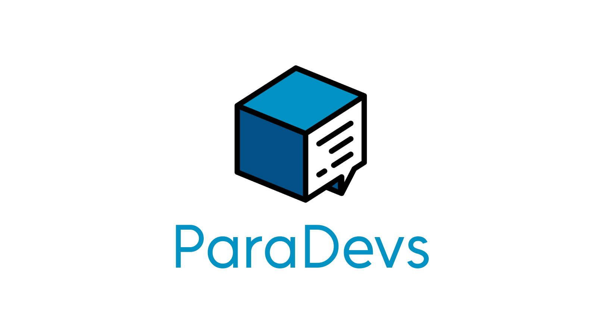

<p align="center">
  
</p>

# 📚 Exemplos e Exercícios — Dia 1

Bem-vindo ao material prático da Oficina de Git & Linux! Essa pasta contém exemplos, exercícios e dados para você praticar os conceitos do Dia 1.

## 📁 Estrutura

```
exemplos-dia1/
├── 1-terminal-basico/           Atalhos e anatomia do terminal
├── 2-usuarios-permissoes/       whoami, sudo, chmod
├── 3-busca-grep-find/           find, grep, locate
├── 4-pipes-encadeamento/        pipes, redirecionamento, encadeamento
├── 5-edicao-nano/               Edição de texto (nano, vim)
├── 6-pacotes/                   apt, instalação de pacotes
├── exercicio-final/             Exercício prático completo
└── reset.sh                      Script para resetar tudo
```

## 🚀 Como usar

### Opção 1: Seguir a ordem das aulas

```bash
# Ir para a pasta do tópico que quer praticar
cd 1-terminal-basico
cat README.md          # ler as instruções
bash exemplo.sh        # rodar exemplos (se houver)
```

### Opção 2: Fazer o exercício final

```bash
cd exercicio-final
bash setup.sh          # prepara o ambiente
cat README.md          # leia as instruções
# ... complete os exercícios
```

## 🔄 Resetar tudo

Se você fez muitas mudanças e quer "limpar", use:

```bash
bash reset.sh
```

Isso remove arquivos criados durante os exercícios e volta tudo ao original.

## 📝 O que tem em cada pasta

### 1. Terminal básico
- Atalhos do terminal (Tab, Ctrl+C, etc)
- Anatomia de um comando
- Prática com `pwd`, `ls`, `cd`

### 2. Usuários e Permissões
- `whoami`, `id`, `groups`
- `sudo` — rodar com privilégios
- `chmod +x` — dar permissão de execução
- Entender rwx (read, write, execute)

### 3. Busca (grep, find)
- `find` — procurar arquivos
- `grep` — procurar dentro de arquivos
- `locate` — busca rápida
- Exemplos com dados reais (logs, etc)

### 4. Pipes e Encadeamento
- `|` (pipe) — conectar comandos
- `>` `>>` (redirecionamento)
- `&&` `||` `;` (encadeamento)
- Exemplos práticos: processar dados com pipes

### 5. Edição de Texto
- `nano` — editor amigável (prática)
- `vim` — editor poderoso (preview)
- `cat`, `less`, `head`, `tail` — leitura

### 6. Pacotes
- `apt update` / `apt install`
- `apt search` / `apt list`
- Instalar ferramentas (vim, curl, etc)

### 7. Exercício Final
- Integra tudo: criar estrutura, editar, buscar, usar pipes
- Prólogo para o Git (Dia 2)

---

## 💡 Dicas

1. **Não tenha medo de errar** — é assim que se aprende terminal
2. **Use `man <comando>`** — a maioria dos comandos tem manual completo
3. **Use Tab para autocompleta** — evita erros de digitação
4. **Guarde este material** — é referência para depois

---

## 🆘 Se algo der errado

### "Comando não encontrado"
Pode ser que o programa não esteja instalado. Tente:
```bash
sudo apt install nome-do-programa
```

### "Permissão negada"
Talvez você precise de `sudo`:
```bash
sudo comando
```

### Estraguei tudo e quero resetar
Use o script de reset:
```bash
bash reset.sh
```

---

## 📚 Referência rápida

| Comando | O que faz |
|---------|-----------|
| `pwd` | Mostra diretório atual |
| `ls -la` | Lista arquivos com detalhes |
| `cd` | Muda de diretório |
| `mkdir` | Cria pasta |
| `touch` | Cria arquivo vazio |
| `cat` | Mostra conteúdo de arquivo |
| `nano` | Edita arquivo |
| `grep` | Busca texto em arquivo |
| `find` | Busca arquivos |
| `chmod +x` | Dá permissão de execução |
| `sudo` | Executa com privilégios |

---

*Oficina de Git & Linux · UFERSA — Campus Pau dos Ferros*
