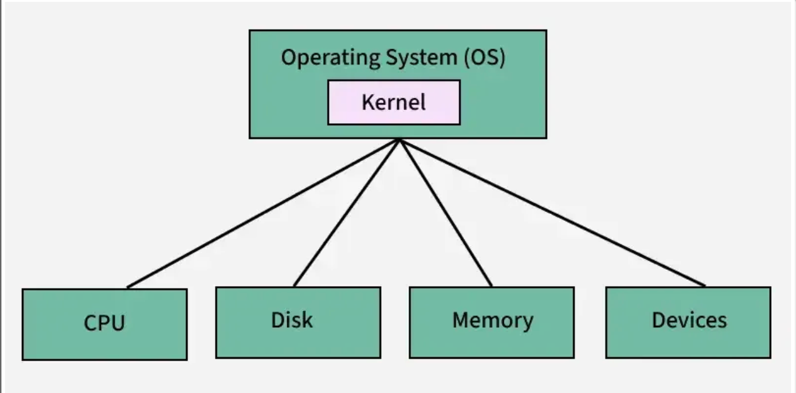
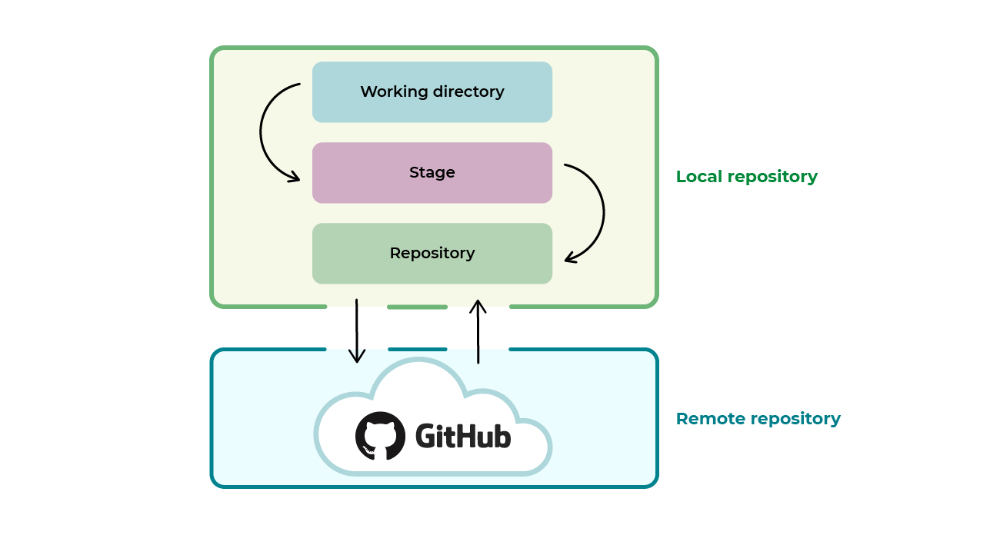

<p align="center">
  
</p>

# Oficina de Git & Linux

### UFERSA — Campus Pau dos Ferros

**ECOP · 17 e 18 de Maio de 2026 · 14h–16h · Laboratório 2 - LTI**

---

> **Para quem é esse material?**
> Essas notas acompanham os dois dias de oficina e servem como referência para consulta depois. Não precisa decorar nada — o objetivo é que você saia sabendo *onde* encontrar o que precisa e com prática suficiente pra não ter medo do terminal.

---

## Sumário

- [Dia 1 — Linux & Git](#dia-1--linux--git)
  - [A história do Linux](#1-a-história-do-linux)
  - [Open source — o que é e por que importa](#2-open-source--o-que-é-e-por-que-importa)
  - [Distribuições Linux](#3-distribuições-linux)
  - [Linux no seu computador — opções de uso](#4-linux-no-seu-computador--opções-de-uso)
  - [O terminal](#5-o-terminal)
  - [Usuários e privilégios](#5a-usuários-e-privilégios)
  - [Navegando pelo sistema de arquivos](#6-navegando-pelo-sistema-de-arquivos)
  - [Manipulando arquivos e diretórios](#7-manipulando-arquivos-e-diretórios)
  - [Buscando arquivos e conteúdo](#7a-buscando-arquivos-e-conteúdo)
  - [Edição de texto no terminal](#7b-edição-de-texto-no-terminal)
  - [Encadeamento de comandos e pipes](#7c-encadeamento-de-comandos-e-pipes)
  - [Instalação de pacotes](#7d-instalação-de-pacotes)
  - [Exercício guiado — Organize seu projeto](#8-exercício-guiado--organize-seu-projeto)
  - [Bash Scripting (bem básico)](#8a-bash-scripting-bem-básico)
  - [Primeiro contato com Git](#9-primeiro-contato-com-git)
  - [Aprofundado — Tópicos avançados](#aprofundado--tópicos-avançados)

---

# Dia 1 — Linux & Git

**Ministrante:** Adrian  
**Horário:** 14h00 – 16h00  
**Objetivo do dia:** entender de onde o Linux veio, por que ele domina o mundo da computação, como usá-lo  — e sair do zero no terminal criando e organizando arquivos com confiança.

---

## 1. A história do Linux

Para entender o Linux, precisamos voltar um pouco mais no tempo.

### Unix — o avô de tudo (1969)

Em 1969, pesquisadores da Bell Labs (laboratório de pesquisa da AT&T) criaram um sistema operacional chamado **Unix**. Ele era elegante, modular e poderoso — e introduziu conceitos que usamos até hoje: tudo é arquivo, processos se comunicam por pipes, usuários têm permissões. O problema: era caro e proprietário.


### O Projeto GNU — a revolução filosófica (1983)

Em 1983, **Richard Stallman**, pesquisador do MIT, lançou o **Projeto GNU** com o objetivo de criar um sistema operacional completamente livre — livre para usar, estudar, modificar e redistribuir. Ele criou ferramentas essenciais (`gcc`, `bash`, `make`...) e formulou a **GPL (General Public License)**, a licença que garante essas liberdades.

O projeto GNU tinha quase tudo — menos o componente central: o **kernel** (o núcleo do sistema que faz a comunicação com o hardware).



### Linus Torvalds e o kernel Linux (1991)


Em 1991, um estudante finlandês de 21 anos chamado **Linus Torvalds** publicou numa lista de e-mails:

> *"Estou fazendo um sistema operacional (livre), apenas um hobby, não será grande e profissional como o GNU..."*

Era o anúncio do **kernel Linux**. Combinado com as ferramentas do GNU, nasceu o sistema que chamamos de **GNU/Linux** — ou simplesmente Linux.

A grande sacada de Linus foi **abrir o código para colaboração pública**. Desenvolvedores do mundo inteiro começaram a contribuir. Em pouco tempo, o que era um hobby virou a base da infraestrutura digital do planeta.

### Linha do tempo

```
1969  -> Unix criado na Bell Labs
1983  -> Richard Stallman inicia o Projeto GNU
1985  -> FSF (Free Software Foundation) fundada
1991  -> Linus Torvalds lança o kernel Linux (v0.01)
1992  -> Linux adota licença GPL — explosão de contribuições
1994  -> Linux kernel 1.0 lançado
1998  -> IBM, Oracle e outros grandes investem em Linux
2003  -> Linux Foundation fundada
2004  -> Ubuntu lançado — Linux acessível para todos
2008  -> Android lançado — baseado em kernel Linux
2011  -> Linux kernel 3.0 — mais de 15 milhões de linhas de código
2016  -> Microsoft anuncia suporte ao Linux no Azure
2019  -> Microsoft lança WSL 2
2024  -> ~96% dos servidores web do mundo rodam Linux
```

### Linus Torvalds hoje

Linus ainda lidera o desenvolvimento do kernel Linux, com mais de **27 milhões de linhas de código** e contribuições de engenheiros de Google, Meta, Microsoft, Intel, Red Hat e centenas de outras empresas. É provavelmente o projeto colaborativo mais bem-sucedido da história humana.

> **Curiosidade:** o próprio Git foi criado por Linus Torvalds em 2005, quando a comunidade do kernel Linux precisava de um sistema de controle de versão melhor. Ou seja, o cara que você vai estudar no Dia 2 foi criado pelo mesmo cara do Dia 1.

---

## 2. Open source — o que é e por que importa

### Software proprietário vs software livre

| | Software proprietário | Software livre / open source |
|---|---|---|
| **Código fonte** | Secreto, só a empresa vê | Público, qualquer um pode ler |
| **Uso** | Conforme licença (geralmente pago) | Livre |
| **Modificação** | Proibida | Permitida |
| **Distribuição** | Proibida ou restrita | Permitida |
| **Exemplos** | Windows, macOS, Photoshop | Linux, Firefox, VLC, Android |

### Por que open source ganhou?

**Segurança real:** código aberto significa que qualquer pessoa pode auditar o software em busca de vulnerabilidades. Bugs são encontrados e corrigidos mais rápido. Não existe "confie em nós" — você pode verificar.

**Qualidade colaborativa:** milhares de desenvolvedores contribuindo é mais poderoso do que qualquer equipe interna. O kernel Linux tem contribuições de engenheiros de todas as maiores empresas de tecnologia do mundo.

**Inovação sem barreira:** startups podem construir produtos sobre bases sólidas sem pagar licenças caras. Isso democratizou a criação de tecnologia — hoje qualquer pessoa com um computador e acesso à internet pode construir algo com as mesmas ferramentas que o Google usa.

**Longevidade:** software proprietário pode ser descontinuado quando a empresa decide. Software open source pertence à comunidade — ninguém pode simplesmente "desligar".

### O paradoxo do Microsoft

Durante anos, a Microsoft foi a maior opositora do open source. Em 2001, o CEO Steve Ballmer chamou o Linux de "câncer". Hoje:

- O **VS Code** (editor mais usado no mundo) é open source
- O **Windows Subsystem for Linux (WSL)** deixa você rodar Linux dentro do Windows
- A Microsoft é uma das maiores contribuidoras do kernel Linux
- O Azure (nuvem da Microsoft) roda majoritariamente Linux

Isso diz muito sobre o quão inevitável o open source se tornou.

### Licenças — uma nota rápida

Nem todo "open source" é igual. As licenças mais comuns:

| Licença | Característica principal |
|---|---|
| **GPL** | Se você usar o código, seu projeto também precisa ser open source |
| **MIT** | Extremamente permissiva — use como quiser, só mantenha o copyright |
| **Apache 2.0** | Permissiva + proteção de patentes |
| **BSD** | Similar à MIT, variações diferentes |

O kernel Linux usa GPL. A maioria das ferramentas que você vai instalar usa MIT ou Apache.

---

## 3. Distribuições Linux


O kernel Linux sozinho não é um sistema operacional utilizável — é só o núcleo. Uma **distribuição (distro)** é o kernel Linux empacotado junto com um conjunto de softwares, um gerenciador de pacotes, uma interface gráfica e configurações padrão.

É como se o kernel fosse um motor, e a distro fosse o carro completo.

### Principais distros e seus perfis

| Distro | Base | Perfil | Gerenciador de pacotes |
|---|---|---|---|
| **Ubuntu** | Debian | Iniciantes, uso geral, servidores | `apt` |
| **Debian** | — | Servidores, estabilidade extrema | `apt` |
| **Linux Mint** | Ubuntu | Migração do Windows, iniciantes | `apt` |
| **Pop!_OS** | Ubuntu | Desenvolvedores, design | `apt` |
| **Fedora** | Red Hat | Desenvolvedores, tecnologias recentes | `dnf` |
| **Arch Linux** | — | Avançados, personalização total | `pacman` |
| **Manjaro** | Arch | Arch acessível | `pacman` |
| **openSUSE** | — | Empresas, desenvolvedores | `zypper` |
| **Kali Linux** | Debian | Segurança, pen testing | `apt` |
| **Raspberry Pi OS** | Debian | Dispositivos embarcados, IoT | `apt` |

### A família das distros

```
Unix (1969)
└── BSD
    └── macOS / FreeBSD / ...
Linux kernel (1991)
├── Debian
│   ├── Ubuntu
│   │   ├── Linux Mint
│   │   ├── Pop!_OS
│   │   └── Raspberry Pi OS
│   └── Kali Linux
├── Red Hat
│   ├── Fedora
│   ├── CentOS (descontinuado)
│   └── RHEL (empresarial)
├── Slackware
└── Arch Linux
    └── Manjaro
```

### Android é Linux?

Sim — o Android usa o kernel Linux. Isso significa que **bilhões de pessoas já usam Linux**, só que sem saber. A diferença é que o Android não usa as ferramentas GNU por cima — usa um conjunto próprio de ferramentas (Bionic, em vez do glibc, por exemplo).

> **Dado:** se você contar Android, servidores, supercomputadores e dispositivos embarcados, Linux é de longe o sistema operacional mais usado no mundo. Windows domina apenas o mercado de desktops pessoais.

### Qual usar?

Para quem está começando: **Ubuntu** ou **Linux Mint**. São as mais amigáveis, têm a maior comunidade e praticamente tudo que você precisar vai ter um tutorial disponível.

---

## 4. Linux no seu computador — opções de uso

Você não precisa formatar seu computador para usar Linux. Existem várias formas de começar:

### Opção 1 — WSL 2 (Windows Subsystem for Linux)

**Para quem:** usuários de Windows que querem experimentar Linux sem abrir mão do que já têm.

O WSL 2 é uma camada de compatibilidade desenvolvida pela Microsoft que roda um kernel Linux real dentro do Windows. Você abre um terminal e está num ambiente Linux completo — com acesso ao seu sistema de arquivos do Windows.

**Como instalar:**

```powershell
# No PowerShell como Administrador:
wsl --install
```

Isso instala o Ubuntu por padrão. Após reiniciar, abra o "Ubuntu" pelo menu iniciar.

Para instalar uma distro específica:

```powershell
wsl --list --online          # ver distros disponíveis
wsl --install -d Debian      # instalar Debian, por exemplo
```

**Vantagens do WSL 2:**

- Sem dual boot, sem formatação
- Integração com o Windows Explorer (você acessa os arquivos Linux pelo Windows e vice-versa)
- Funciona com VS Code (extensão Remote - WSL)
- Kernel Linux real — não é emulação

**Limitações:**

- Sem interface gráfica nativa (pode ser configurada, mas é burocrático)
- Performance de I/O um pouco inferior ao Linux nativo para alguns casos

### Opção 2 — Máquina Virtual (VM)

Roda Linux dentro de uma janela no seu sistema atual. Ferramentas populares:

- **VirtualBox** — gratuito, open source, funciona em Windows/Mac/Linux
- **VMware** — mais performático, versão gratuita disponível
- **UTM** — para Mac com Apple Silicon

**Quando usar:** quando você precisa de uma interface gráfica completa do Linux, mas não quer instalar nativamente.

### Opção 3 — Dual Boot

Instalar Linux ao lado do Windows no mesmo computador. Na inicialização, você escolhe qual sistema carregar.

**Vantagens:** performance nativa, experiência completa do Linux.  
**Desvantagens:** requer mais cuidado na instalação, risco de perder dados se não fizer direito.

### Opção 4 — Linux nativo

Formatar e instalar Linux como sistema principal. É a experiência mais completa.

**Recomendação:** Ubuntu 22.04 LTS ou Linux Mint 21 para quem está migrando.

### Opção 5 — Live USB

Baixar a ISO de uma distro, gravar num pendrive com Rufus ou Etcher, e bootar por ele sem instalar nada. Bom para testar antes de instalar.

### Opção 6 — Serviços na nuvem

| Serviço | Link | O que oferece |
|---|---|---|
| **Replit** | replit.com | Terminal Linux no navegador |
| **GitHub Codespaces** | github.com/codespaces | VS Code + terminal Linux na nuvem |
| **Killercoda** | killercoda.com | Ambientes Linux interativos gratuitos |
| **Play with Docker** | labs.play-with-docker.com | Terminal Alpine Linux gratuito |

> **Para hoje na oficina:** estamos no laboratório com Linux disponível nas máquinas. Se você está com o seu notebook Windows, **recomendamos instalar o WSL 2** — é o caminho mais prático pra continuar praticando em casa depois.

---

## 5. O terminal

O **terminal** (também chamado de shell, linha de comando, CLI) é uma interface de texto para o sistema operacional. Em vez de clicar em ícones, você *digita comandos*.

### Anatomia do prompt

Quando você abre o terminal, vê algo assim:

```
usuario@maquina:~/Downloads$
```

| Parte | Significado |
|---|---|
| `usuario` | Seu nome de usuário |
| `maquina` | Nome da máquina |
| `~/Downloads` | Diretório atual (`~` = seu home) |
| `$` | Você está como usuário comum (seria `#` se fosse root) |

### Como funciona um comando

```
ls -la /home/usuario
│   │    └── argumento (sobre o que o comando age)
│   └── flag/opção (modifica o comportamento)
└── comando (o que fazer)
```

### Atalhos essenciais do terminal

| Atalho | O que faz |
|---|---|
| `Tab` | Autocompleta comandos e nomes de arquivos |
| `↑` / `↓` | Navega pelo histórico de comandos |
| `Ctrl + C` | Cancela o comando em execução |
| `Ctrl + L` | Limpa a tela (igual ao `clear`) |
| `Ctrl + A` | Move o cursor para o início da linha |
| `Ctrl + E` | Move o cursor para o fim da linha |

> **Dica:** use Tab o tempo todo. Ele evita erros de digitação e te mostra o que está disponível.

---

## 5a. Usuários e privilégios

### Quem é você no Linux?

No prompt você vê:

```
usuario@maquina:~/Downloads$
```

Esse `usuario` é importante. Linux é um sistema **multi-usuário** — várias pessoas podem usar a mesma máquina simultaneamente, e cada uma tem suas pastas e permissões.

#### Comandos de identificação

```bash
$ whoami                    # mostra seu nome de usuário
usuario

$ id                        # mostra ID do usuário, grupos, etc
uid=1000(usuario) gid=1000(usuario) groups=1000(usuario),27(sudo)

$ groups                    # mostra grupos a que você pertence
usuario sudo

$ sudo whoami               # quem você é com privilégios de admin?
root
```

### O usuário `root`

`root` é o **administrador** do sistema — tem permissão para **tudo**. Você é um usuário comum.

Para executar um comando com privilégios de admin, use `sudo` (**S**uper **U**ser **DO**):

```bash
rm /etc/arquivo-sistema.conf      # ❌ Sem permissão! Erro.
sudo rm /etc/arquivo-sistema.conf # ✅ Com sudo funciona
```

> **⚠️ Cuidado com `sudo`:** com poder vem responsabilidade. Não execute `sudo` em comandos que você não entende — pode quebrar o sistema.

### Permissões de arquivo

Quando você faz `ls -la`, vê algo assim:

```
drwxr-xr-x  2 usuario grupo  4096 mai 15 14:00 Downloads
-rw-r--r--  1 usuario grupo  1024 mai 15 10:30 arquivo.txt
-rwxr-xr-x  1 usuario grupo  8192 mai 15 11:00 script.sh
```

A primeira coluna mostra **permissões**:

```
-rw-r--r--
│││││││││
││└─┬──┬─ outro (others): r-- = lê, mas não escreve nem executa
│└──┬──┬─ grupo (group): r-- = lê, mas não escreve nem executa
└───┬──┬─ dono (user): rw- = lê e escreve, mas não executa
    └─┬─ tipo: - = arquivo regular, d = diretório
```

| Símbolo | Significado |
|---------|---|
| `r` (read) | Permissão de leitura (ler arquivo, listar diretório) |
| `w` (write) | Permissão de escrita (modificar arquivo, criar arquivos no diretório) |
| `x` (execute) | Permissão de execução (rodar arquivo como programa, entrar em diretório) |
| `-` | Sem permissão |

#### Mudando permissões com `chmod`

```bash
chmod +x script.sh           # torna o arquivo executável
chmod -x script.sh           # remove permissão de execução
chmod 755 script.sh          # modo numérico (avançado — veja seção aprofundada)
```

Prático: quando você baixa um script `.sh`, geralmente precisa fazer `chmod +x` antes de rodar:

```bash
./script.sh                  # ❌ Permission denied
chmod +x script.sh           # dar permissão
./script.sh                  # ✅ Funciona!
```

---

## 6. Navegando pelo sistema de arquivos

O sistema de arquivos do Linux tem uma estrutura em árvore que começa na raiz `/`.

```
/
├── home/
│   └── usuario/          ← seu "home" (~)
│       ├── Downloads/
│       ├── Documentos/
│       └── ...
├── etc/                  ← arquivos de configuração
├── var/                  ← logs e dados variáveis
└── usr/                  ← programas instalados
```

### Comandos de navegação

#### `pwd` — Print Working Directory

Mostra em qual diretório você está agora.

```bash
$ pwd
/home/usuario
```

#### `ls` — List

Lista os arquivos e diretórios do local atual.

```bash
$ ls
Documentos  Downloads  imagens  script.py

$ ls -l          # formato longo (detalhado)
$ ls -a          # mostra arquivos ocultos (começam com .)
$ ls -la         # detalhado + ocultos (mais usado)
$ ls Downloads/  # lista um diretório específico
```

A saída do `ls -la` tem esse formato:

```
drwxr-xr-x  2 usuario grupo  4096 mai 15 14:00 Downloads
│││││││││     │         │     │    └── data
│││││││││     └── dono  └── tamanho
└─────────── permissões (d = diretório, - = arquivo)
```

#### `cd` — Change Directory

Muda o diretório atual.

```bash
cd Downloads/        # entra na pasta Downloads
cd ..                # volta um nível
cd ../..             # volta dois níveis
cd ~                 # vai direto para o home
cd /etc              # caminho absoluto (começa em /)
cd -                 # volta pro diretório anterior
```

**Caminhos absolutos vs relativos:**

- **Absoluto:** começa em `/` — funciona de qualquer lugar: `/home/usuario/Downloads`
- **Relativo:** parte do diretório atual — `Downloads/` ou `../outro`

### Prática — navegação

Faça junto:

```bash
pwd                   # onde estou?
ls                    # o que tem aqui?
ls -la                # com detalhes
cd Downloads          # entrar em Downloads
pwd                   # confirmar onde estou
ls                    # o que tem aqui?
cd ..                 # voltar
cd ~                  # ir para home
```

---

## 7. Manipulando arquivos e diretórios

### Criando diretórios

#### `mkdir` — Make Directory

```bash
mkdir projetos                    # cria uma pasta
mkdir projetos/web                # cria dentro de outra (a pasta "projetos" já precisa existir)
mkdir -p projetos/web/src/css     # cria toda a estrutura de uma vez (-p = parents)
```

### Criando e escrevendo arquivos

#### `touch`

Cria um arquivo vazio ou atualiza a data de modificação.

```bash
touch index.html
touch style.css script.js         # vários de uma vez
```

#### `echo` com redirecionamento

```bash
echo "Olá, mundo!"                # imprime no terminal
echo "Olá" > saudacao.txt         # escreve em arquivo (sobrescreve)
echo "Linha 2" >> saudacao.txt    # adiciona ao fim do arquivo
```

### Lendo arquivos

#### `cat` — Concatenate

```bash
cat saudacao.txt                  # exibe o conteúdo
cat arq1.txt arq2.txt             # exibe dois arquivos seguidos
```

#### `less` e `head` / `tail`

```bash
less arquivo-grande.txt           # lê com paginação (q para sair)
head -5 arquivo.txt               # primeiras 5 linhas
tail -5 arquivo.txt               # últimas 5 linhas
```

### Copiando e movendo

#### `cp` — Copy

```bash
cp origem.txt destino.txt         # copia arquivo
cp -r pasta/ pasta-copia/         # copia pasta inteira (-r = recursivo)
```

#### `mv` — Move / Rename

```bash
mv arquivo.txt novo-nome.txt      # renomeia
mv arquivo.txt pasta/             # move para outra pasta
mv pasta/ nova-pasta/             # renomeia pasta
```

### Removendo

#### `rm` — Remove

```bash
rm arquivo.txt                    # remove arquivo
rm -r pasta/                      # remove pasta e todo o conteúdo
rm -i arquivo.txt                 # pede confirmação antes (-i = interactive)
```

> ⚠️ **Atenção:** `rm` no Linux não tem lixeira. O arquivo some de vez. Use com cuidado.

### Outros comandos úteis

```bash
man ls                            # manual completo do comando ls
history                           # histórico de comandos usados
which python3                     # mostra onde está instalado um programa
file imagem.jpg                   # identifica o tipo de um arquivo
```

---

## 7a. Buscando arquivos e conteúdo

Às vezes você não se lembra aonde está um arquivo ou quer buscar por padrão. O Linux tem várias formas de procurar.

### `find` — procurar arquivos por nome e atributos

```bash
find . -name "*.txt"              # todos os arquivos .txt a partir de aqui
find ~ -name "foto-*.jpg"         # fotos com padrão específico
find /etc -type f -name "*.conf"  # só arquivos (-type f), não diretórios
find . -type d -name "node_modules"  # procura diretórios específicos
find . -size +10M                 # arquivos maiores que 10MB
```

### `grep` — buscar texto dentro de arquivos

```bash
grep "erro" arquivo.log           # linhas que contêm "erro"
grep -i "Erro" arquivo.log        # case-insensitive (-i = ignore case)
grep -n "erro" arquivo.log        # mostra número da linha (-n)
grep -r "TODO" .                  # busca recursiva em todas as pastas
grep -v "comentário" codigo.py    # linhas que NÃO contêm a palavra (-v = invert)
```

### `locate` — busca rápida (usa um índice)

```bash
locate python3                    # procura por "python3" em todo o sistema
updatedb                          # atualiza o índice (às vezes precisa)
```

> **Dica:** `find` é mais "ao vivo" mas mais lento. `locate` é rápido mas usa cache.

---

## 7b. Edição de texto no terminal

Até agora usamos `echo` para criar arquivos. Mas quando precisa **editar** um arquivo direto no terminal?

### `nano` — editor amigável

O `nano` é o mais fácil para iniciantes:

```bash
nano README.md                    # abre para edição
```

Dentro do `nano`:

- Digita normalmente
- `Ctrl + X` → sai (pede pra salvar)
- `Ctrl + O` → salva
- `Ctrl + W` → busca (find)
- `Ctrl + \` → busca e substitui

Exemplo prático:

```bash
$ nano meu-arquivo.txt
# (digita algo)
# Ctrl + X
# Y (sim)
# Enter (confirma nome do arquivo)
```

### Verificar o conteúdo (sem editar)

Se só quer **ler** o arquivo:

```bash
cat arquivo.txt                   # mostra inteiro
less arquivo.txt                  # mostra com paginação (q para sair)
head -10 arquivo.txt              # primeiras 10 linhas
tail -5 arquivo.txt               # últimas 5 linhas
```

---

## 7c. Encadeamento de comandos e pipes

Um dos **superpoderes** do terminal é encadear comandos — fazer um comando passar o resultado para o próximo.

### Pipes: `|` — conectando comandos

O pipe (`|`) pega a **saída** de um comando e passa como **entrada** para o próximo:

```bash
cat arquivo-grande.txt | grep "erro"       # acha linhas com "erro"
ls -la | grep ".txt"                       # lista só arquivos .txt
history | grep "python"                    # vê comandos que usou com python
ps aux | grep "firefox"                    # vê processos Firefox em execução
```

**Exemplo real:** você tem um arquivo com 1000 linhas e quer contar quantas vezes a palavra "bug" aparece:

```bash
grep "bug" arquivo.log | wc -l             # 'wc -l' conta linhas
```

**Outro exemplo:** listar arquivos `.js` ordenados por tamanho:

```bash
ls -la | grep "\.js" | sort -k5 -n        # sort ordena por tamanho (coluna 5)
```

### Redirecionamento: `>` e `>>`

Já vimos isso, mas vale reforçar:

```bash
echo "primeira linha" > arquivo.txt        # cria/sobrescreve
echo "segunda linha" >> arquivo.txt        # adiciona ao fim
cat arquivo-grande.txt > backup.txt        # copia conteúdo (sobrescreve)
grep "erro" sistema.log > erros.txt        # salva resultado em arquivo
```

### Encadeamento de comandos: `&&`, `;` e `||`

Às vezes você quer rodar vários comandos um depois do outro. Existem formas de fazer isso:

#### `&&` — só roda o próximo se o anterior tiver **sucesso**

```bash
$ cd meu-projeto && npm install && npm start
# Se 'cd' falhar, npm install não roda
# Se npm install falhar, npm start não roda
```

Útil para evitar rodar comandos dependentes se um falhar.

#### `;` — roda independente do resultado

```bash
$ mkdir backup ; cp arquivo.txt backup/
# Mesmo que mkdir falhe, cp vai tentar rodar
```

#### `||` — roda só se o anterior **falhar**

```bash
$ npm install || echo "Erro na instalação!"
# Se npm install falhar, imprime mensagem
```

---

## 7d. Instalação de pacotes

Linux tem **gerenciadores de pacotes** — ferramentas que instalam software pra você. No Ubuntu/Debian, é o `apt`.

### Estrutura básica

```bash
sudo apt update                   # atualiza lista de pacotes disponíveis
sudo apt install nome-do-pacote   # instala um pacote
sudo apt remove nome-do-pacote    # desinstala
apt list --installed              # lista pacotes instalados
apt search python                 # busca pacotes com "python" no nome
```

### Exemplos práticos

```bash
# Instalar Python
$ sudo apt update
$ sudo apt install python3

# Instalar Node.js
$ sudo apt install nodejs npm

# Instalar Git (se não tiver)
$ sudo apt install git

# Instalar Nano (geralmente vem pré-instalado)
$ sudo apt install nano
```

> **Por que `sudo`?** Instalar pacotes afeta o sistema inteiro, então precisa de privilégios de admin.

### Atualizações do sistema

```bash
sudo apt update                   # sincroniza lista de pacotes
sudo apt upgrade                  # atualiza pacotes já instalados
sudo apt full-upgrade             # atualiza agressivamente (cuidado)
```

### Outras distribuições

Se você estiver usando **Fedora** ou **Red Hat**:

```bash
sudo dnf install python3          # dnf é o gerenciador deles
sudo dnf search python
```

Se está em **Arch Linux**:

```bash
sudo pacman -S python             # pacman é o gerenciador
sudo pacman -Syu                  # atualiza tudo
```

---

## 8. Exercício guiado — Organize seu projeto

**Objetivo:** criar, usando *apenas o terminal*, a seguinte estrutura de arquivos:

```
meu-projeto/
├── src/
│   ├── index.html
│   └── style.css
├── docs/
│   └── sobre.txt
└── README.md
```

**Passo a passo:**

```bash
# 1. Criar a estrutura de pastas
mkdir -p meu-projeto/src meu-projeto/docs

# 2. Criar os arquivos
touch meu-projeto/src/index.html
touch meu-projeto/src/style.css
touch meu-projeto/docs/sobre.txt

# 3. Criar o README com conteúdo
echo "# Meu Projeto" > meu-projeto/README.md
echo "Projeto criado na Oficina de Git & Linux — UFERSA" >> meu-projeto/README.md

# 4. Escrever seu nome no sobre.txt
echo "Feito por: Seu Nome" > meu-projeto/docs/sobre.txt

# 5. Verificar a estrutura criada
ls -R meu-projeto/
```

**Desafio extra:**

```bash
# Copiar a pasta src/ para src-backup/
cp -r meu-projeto/src meu-projeto/src-backup

# Renomear style.css para main.css dentro de src/
mv meu-projeto/src/style.css meu-projeto/src/main.css

# Verificar o resultado
ls -la meu-projeto/src/

# Remover o backup (com confirmação)
rm -ri meu-projeto/src-backup/
```

---

## 8a. Bash Scripting (bem básico)

Um script Bash é só um arquivo com vários comandos para executar de uma vez.

Exemplo simples:

```bash
#!/usr/bin/env bash
echo "Olá, $USER!"
echo "Hoje é: $(date '+%d/%m/%Y')"
```

Salvar como `boas_vindas.sh` e rodar:

```bash
chmod +x boas_vindas.sh
./boas_vindas.sh
```

Exemplo com variável + `if` simples:

```bash
#!/usr/bin/env bash
NOME="$1"

if [ -z "$NOME" ]; then
  echo "Uso: ./saudacao.sh SEU_NOME"
else
  echo "Bem-vindo(a), $NOME!"
fi
```

---

## 9. Primeiro contato com Git

> Isso é uma *introdução* — a aula completa de Git acontece no Dia 2. O objetivo aqui é ter uma ideia geral antes de chegar lá.

### O problema que o Git resolve

Imagine que você está desenvolvendo um projeto e, em algum momento, percebe que estragou algo que funcionava antes. Sem controle de versão, não tem como voltar.

Agora imagine que você e mais 3 pessoas trabalham no mesmo projeto, cada um editando arquivos. Como juntar tudo sem sobrescrever o trabalho de ninguém?

**Git** é a resposta para os dois problemas.

### O que é um commit?

Um **commit** é uma "fotografia" do estado do seu projeto em um momento específico. Você pode:

- Voltar para qualquer commit anterior
- Ver exatamente o que mudou entre dois commits
- Trabalhar em versões paralelas (branches)

### Os três estados de um arquivo no Git

```
Working Tree  ──git add──▶  Stage (Index)  ──git commit──▶  Repositório
(seus arquivos)              (preparado)                      (histórico)
```



### Prévia dos comandos

```bash
git init              # inicializa um repositório Git na pasta atual
git status            # mostra o estado dos arquivos
git add .             # prepara todos os arquivos para commit
git commit -m "msg"   # cria um commit com uma mensagem
git log --oneline     # vê o histórico de commits
```

> Na próxima aula, você vai colocar tudo isso em prática.

### Para casa (opcional, mas recomendado)

Antes do Dia 2:

1. **Crie sua conta no GitHub:** [github.com/signup](https://github.com/signup)
2. **Clone o repositório da oficina** — o link será compartilhado ao final dessa aula
3. **Explore:** tente criar mais pastas e arquivos no terminal por conta própria

---

# Aprofundado — Tópicos avançados

Os tópicos abaixo não serão cobertos em detalhes na aula (por questão de tempo), mas estão documentados aqui para você estudar depois. Eles são úteis quando você já está confortável com o básico.

## A. Permissões numéricas (modo octal)

Além de `chmod +x`, existe uma forma numérica:

```
r (read)    = 4
w (write)   = 2
x (execute) = 1
```

Você soma os valores:

```
rwx = 4+2+1 = 7
rw- = 4+2   = 6
r-x = 4+1   = 5
r-- = 4     = 4
-wx = 2+1   = 3
-w- = 2     = 2
--x = 1     = 1
--- = 0     = 0
```

Então `chmod 755 arquivo` significa:

- **7** (dono): rwx — lê, escreve, executa
- **5** (grupo): r-x — lê e executa, não escreve
- **5** (outros): r-x — lê e executa, não escreve

Uso comum:

```bash
chmod 755 script.sh          # executável, mas só o dono modifica
chmod 644 documento.txt      # todos leem, só dono escreve
chmod 600 arquivo-privado    # só o dono acessa
```

## B. Variáveis de ambiente e PATH

O sistema usa **variáveis** para armazenar informações. Você as acessa com `$`:

```bash
$ echo $HOME                   # seu diretório home
/home/usuario

$ echo $USER                   # seu nome de usuário
usuario

$ echo $PATH                   # lista de diretórios onde o sistema procura programas
/usr/local/sbin:/usr/local/bin:/usr/sbin:/usr/bin:/sbin:/bin
```

### PATH — por que é importante?

Quando você digita `python3`, o Linux procura em cada diretório listado em `$PATH` até encontrar um arquivo chamado `python3`. Se não encontrar em nenhum, diz "comando não encontrado".

```bash
$ which python3                # mostra em qual diretório está
/usr/bin/python3

$ /usr/bin/python3 --version   # você pode chamar pelo caminho completo
Python 3.10.12
```

Se instalar um programa manualmente numa pasta que não está em `PATH`, você precisa:

```bash
$ ~/bin/meu-programa           # chamar pelo caminho completo
# ou adicionar a pasta ao PATH (veja seção sobre .bashrc)
```

## C. Processos em background

Às vezes você quer rodar um comando mas continuar usando o terminal:

```bash
$ python3 servidor.py &          # & coloca o processo em background
[1] 12345                         # número do job e PID
```

Você continua no prompt. Se o processo imprimir algo, você vê na tela mesmo:

```bash
$ jobs                           # lista processos em background
[1]+  Running    python3 servidor.py

$ fg                             # traz o processo pra foreground
(Ctrl + C para parar)

$ bg                             # manda pro background de novo
```

### `nohup` — rodar mesmo se fechar o terminal

```bash
$ nohup python3 servidor.py &
# Processo continua rodando mesmo se você fechar o terminal
```

A saída é salva em `nohup.out`.

## D. Pipes avançados e redirecionamento

### Redirecionamento de erro

```bash
comando 2> erros.txt          # redireciona erros (stderr) para arquivo
comando > saida.txt 2>&1      # redireciona saída E erros para arquivo
comando 2> /dev/null          # descarta erros (envia para "nada")
```

### Pipes encadeados

Você pode encadear muitos comandos:

```bash
$ cat usuarios.txt | grep "admin" | cut -d: -f1 | sort | uniq
# 1. Lê arquivo
# 2. Filtra linhas com "admin"
# 3. Pega primeiro campo (cut)
# 4. Ordena
# 5. Remove duplicatas
```

### `tee` — salva e passa adiante

```bash
$ cat arquivo.txt | tee copia.txt | grep "palavra"
# Salva o arquivo EM cópia.txt E passa para grep
```

## E. Alias — atalhos de comandos

No arquivo `~/.bashrc` ou `~/.zshrc`, você pode criar alias (apelidos):

```bash
alias ll='ls -la'
alias python='python3'
alias gst='git status'
alias myproject='cd ~/projetos/meu-projeto'
```

Depois, digitar `ll` é igual a `ls -la`. Para ativar:

```bash
source ~/.bashrc              # recarrega o arquivo
```

Ou simplesmente abra um novo terminal.

## F. Operadores de busca com `find` — avançado

```bash
find . -name "*.txt" -o -name "*.md"    # find com OR
find . -type f -not -name "*.tmp"       # arquivos que NÃO são .tmp
find . -mtime -7                        # modificados nos últimos 7 dias
find . -executable -type f              # arquivos executáveis
```

## G. Regex — Expressões regulares

`grep` suporta padrões (regex):

```bash
grep "^erro" arquivo.log     # linhas que COMEÇAM com "erro"
grep "sucesso$" arquivo.log  # linhas que TERMINAM com "sucesso"
grep "error[0-9]" arquivo    # "error" seguido de qualquer número
grep -E "^(erro|warn)" arquivo   # múltiplos padrões (extended regex)
```

## H. Compressão de arquivos com `tar`

```bash
tar -czf arquivo.tar.gz pasta/    # compacta uma pasta (tar + gzip)
tar -tzf arquivo.tar.gz          # lista o que tem dentro
tar -xzf arquivo.tar.gz          # descompacta

zip -r pasta.zip pasta/          # compacta como .zip
unzip pasta.zip                  # descompacta .zip
```

## I. APIs no terminal com `curl` + `jq`

Quando a resposta vem em JSON, `jq` ajuda a filtrar só o que importa:

```bash
curl -s "https://api.github.com/repos/torvalds/linux" | jq '.full_name, .stargazers_count'
# "torvalds/linux"
# 201234 (exemplo)
```

Outro exemplo prático (listar nomes de branches):

```bash
curl -s "https://api.github.com/repos/torvalds/linux/branches?per_page=5" | jq '.[].name'
```

Se `jq` não estiver instalado:

```bash
sudo apt install jq
```

## J. Links simbólicos (atalhos)

```bash
$ ln -s /caminho/longo/arquivo.txt atalho.txt
# Cria um "atalho" que aponta para o arquivo real
# Se mover o arquivo real, o atalho quebra
```

## K. Wildcards e expansão

```bash
rm *.log                     # remove todos arquivos .log
cp arquivo.{txt,md,html} backup/  # copia 3 variações
ls [0-9]*                    # lista arquivos que começam com número
```

---

*Oficina de Git & Linux · UFERSA — Campus Pau dos Ferros*  
*Material produzido para uso livre pelos participantes*
